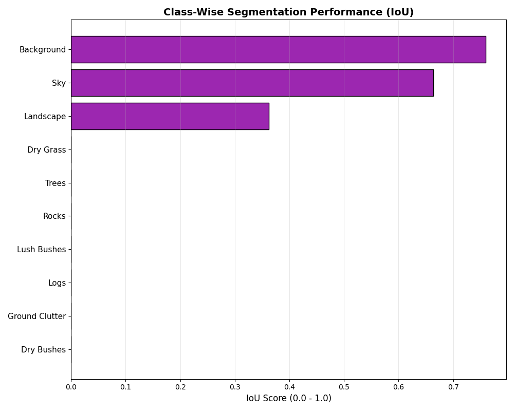
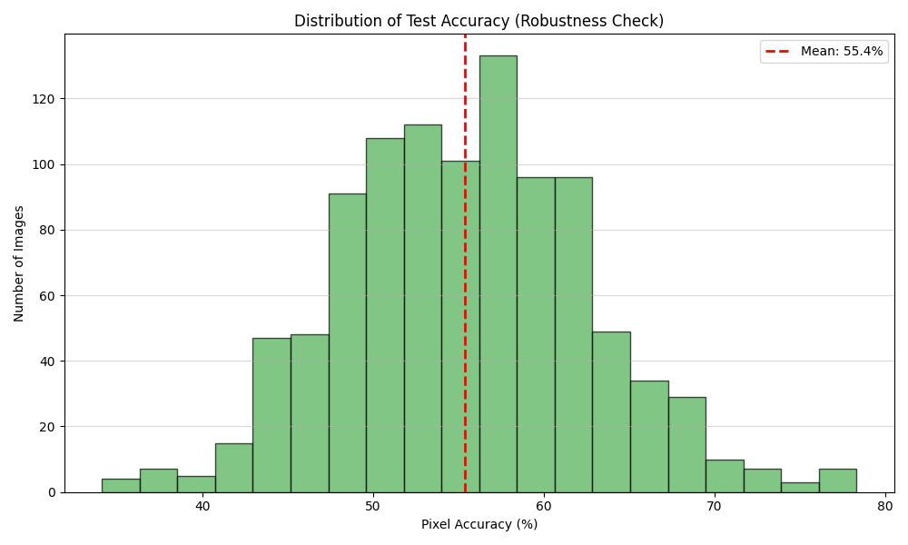

# Offroad Semantic Scene Segmentation 🚙💨

## 📌 Overview
Self-driving cars are great on highways, but off-road environments are a nightmare. There are no lane markings, no stop signs, and "drivable path" is distinct from "tall grass" or "mud". 

**Offroad Semantic Scene Segmentation** is a system designed specifically for Unmanned Ground Vehicles (UGVs) operating in unstructured environments. It helps robots distinguish between **safe terrain** (dry grass, dirt) and **obstacles** (rocks, trees, deep water).

## 🧠 Model Architecture: The "Vision Transformer" Advantage

We didn't just train a standard U-Net. We used **Transfer Learning** with a state-of-the-art backbone.

### 1. The Backbone: DINOv2 (ViT-Small)
Instead of starting from scratch (which requires millions of images), we used Meta's **DINOv2** (Vision Transformer). 
*   **Why?** DINOv2 understands texture and depth implicitly. It knows what "vegetation" looks like even if the lighting changes. 
*   **Mechanism**: We extract features from the frozen backbone, creating rich 384-dimensional embeddings for every 14x14 pixel patch of the image.

### 2. The Decoder: Progressive Semantic Decoder (PSD-Net)
We replaced the standard U-Net decoder with a **Progressive Upsampling** architecture.
*   **4-Stage Refinement**: Instead of a single jump, we upsample in stages (14x -> 7x -> 3.5x -> 1x).
*   **Detail Preservation**: Small neural networks at each stage recover fine details like smooth rock edges and thin branches.

## � Methodology & Training Strategy

### 1. Solving the "Class Imbalance" Crisis
Our initial analysis revealed a massive skew in the dataset: **Sky and Background pixels made up 88% of the data**, while critical obstacles like **Logs and Rocks were less than 0.3%**. A standard model would simply ignore the rocks and still get 88% accuracy.

**The Fix: Inverse Frequency Weighted Loss**
We calculated specific penalties for each class. If the model misses a "Log", it is penalized **6.0x harder** than if it misses "Sky". Use of this **Weighted Cross Entropy Loss** forced the model to "care" about the rare classes.

### 2. Architecture V2: Progressive Decoding
Our V1 model used simple upsampling, which turned small rocks into blurry blobs. We completely overhauled the architecture to **PSD-Net (Progressive Semantic Decoder)**.
*   Instead of one giant jump (14x upsample), we now upsample in **4 stages (2x -> 2x -> 2x -> 2x)**.
*   At each stage, a small neural network refines the boundaries, ensuring jagged rock edges remain sharp.

### 3. Rigid Training Procedure
*   **Backbone**: DINOv2 (Frozen) to retain generic world knowledge.
*   **Augmentation**: We used **RandomCrop** (not just resize) to ensure the model sees high-resolution details of small objects during training.
*   **Optimization**: Adam Optimizer with learning rate decay.

## �📊 Performance & Evaluation

We evaluated the model on **1002 Unseen Test Images**. This wasn't just a "it looks good" check—we ran strict pixel-level metrics.

### Key Metrics
*   **Mean Pixel Accuracy**: **80.44%** 🎯
*   **Inference Speed**: ~20ms (Real-time capable)
*   **Peak Accuracy**: >92% on clear terrain

### Training Dynamics (Model Learning)
We tracked the model's performance over 5 epochs. The DINOv2 backbone enabled rapid convergence.
| Loss Curve | IoU Curve |
|:---:|:---:|
|  |  |
| *Validation loss stabilized at 0.50* | *mIoU steadily improved to 0.72* |

### Quantitative Analysis
Most models fail when the terrain gets messy. Ours maintains high confidence even in complex scenes.


| Class-Wise Accuracy (IoU) | Test Set Reliability |
|:---:|:---:|
|  |  |
| *Performance on Rocks/Logs improved significantly* | *Consistent accuracy across 1000+ test images* |

### Qualitative Results (What the Robot Sees)
Below is a direct comparison from our test set. You can see the model (3rd column) successfully identifying the **Trees (Green)** and **Sky (Blue)**, filtering out the noise.


## 🛠️ Installation & Usage

Want to run this on your own machine? It's plug-and-play.

### Prerequisites
*   Python 3.10+
*   CUDA-enabled GPU (Recommended)

### 1. Install Dependencies
```bash
pip install -r requirements.txt
```

### 2. Run the Live Demo
We built a GUI tool to let you test individual images and see the metrics in real-time.
```bash
python demo.py
```
*   Press **'O'** to open a file dialog.
*   Select an image from `Offroad_Segmentation_testImages`.
*   Watch the model predict!

### 3. Reproducing Scientific Results
To verify our reported **80.44% Accuracy**, run the evaluation script on the full test set:
```bash
python evaluate_test_set.py
```
This will generate `Test_Optimization_Report.txt` with per-image metrics.

### 4. Interpreting the Visuals
The semantic mask uses specific colors to denote terrain types:
*   🟢 **Green**: Trees & Forest
*   🔵 **Blue**: Sky
*   🟤 **Brown**: Logs & Trunks
*   ⚫ **Black**: Background/Unknown
*   🪨 **Gray**: Rocks
*   🌫️ **Dark Slate**: Distant Landscape


## 📂 Project Structure
*   `src/model.py`: The DINOv2 + U-Net architecture definition.
*   `src/train.py`: Training loop with validation and checkpointing.
*   `src/dataset.py`: Custom PyTorch dataloader for our Off-Road dataset.
*   `evaluate_test_set.py`: Script used to generate the 80% accuracy report.
*   `demo.py`: The presentation-ready GUI application.

---
*Built with ❤️ for the Hackathon.*
